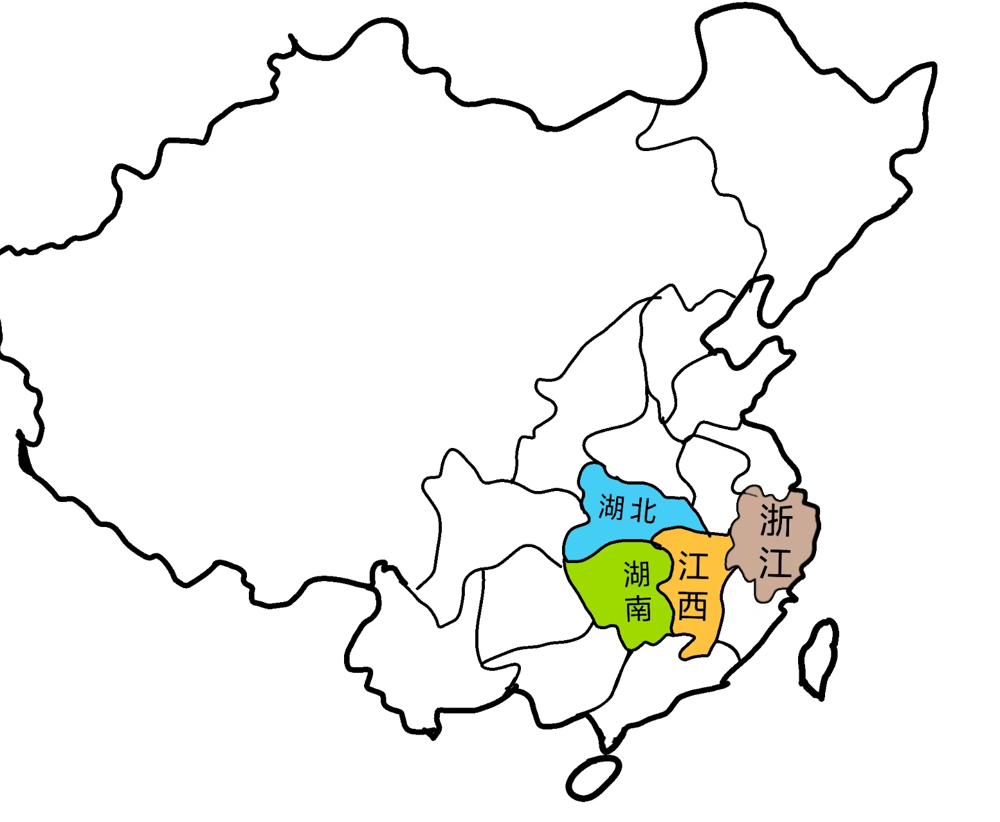
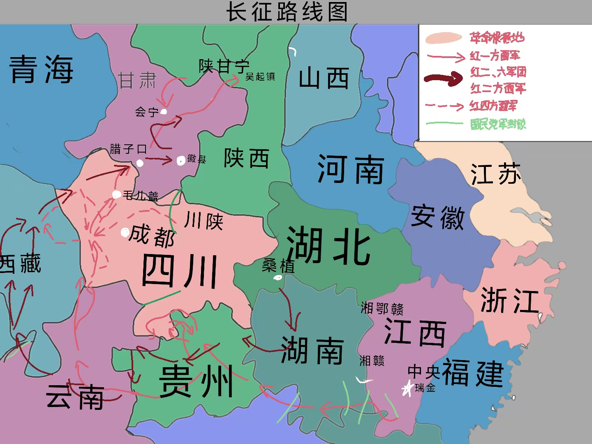
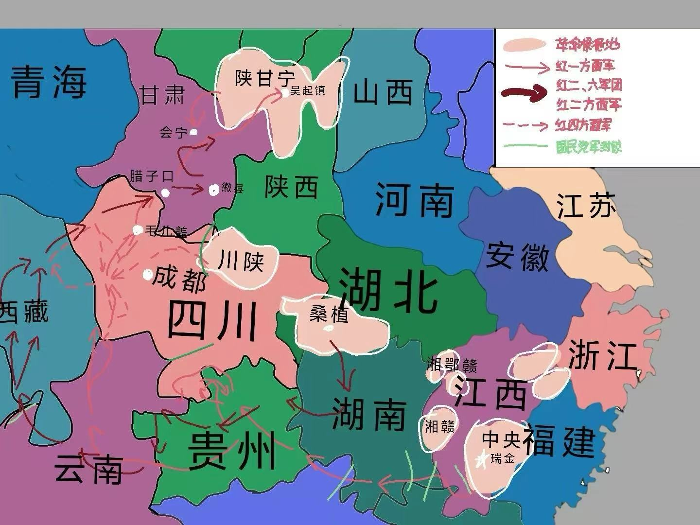

<!DOCTYPE html>
<html lang="zh-CN">
<head>
    <meta charset="UTF-8">
    <meta name="viewport" content="width=device-width, initial-scale=1.0">
    <title>红色征程：中国革命历史交互地图</title>
    <link rel="stylesheet" href="https://cdnjs.cloudflare.com/ajax/libs/font-awesome/6.4.0/css/all.min.css">
    
</head>
<body>
    

        

        

        

        

    

    
    

        <header>
            <h1>红色征程</h1>
            
中国革命历史交互地图

            

                <i class="fas fa-history"></i>
                探索革命历程 · 传承红色基因
            

        </header>
        
        

            

                
1921-1927

                
初期斗争

                
革命萌芽时期

            

            

                
1927-1934

                
长征之路

                
战略转移与长征

            

            

                
1921-1934

                
星星之火

                
革命力量发展

            

        

        
        

            

                

                    <h3><i class="fas fa-layer-group"></i> 历史时期</h3>
                    <button class="layer-btn active" id="layer1Btn">
                        <i class="fas fa-seedling"></i> 初期斗争图
                    </button>
                    
1921-1927 · 革命初期斗争与探索

                    
                    <button class="layer-btn" id="layer2Btn">
                        <i class="fas fa-route"></i> 长征之路
                    </button>
                    
1927-1934 · 战略转移与长征

                    
                    <button class="layer-btn" id="layer3Btn">
                        <i class="fas fa-fire"></i> 星星之火
                    </button>
                    
1921-1934 · 革命力量发展壮大

                    
                    

                        
<strong><i class="fas fa-landmark"></i> 历史背景：</strong>

                        
这三个时期展现了中国革命从萌芽到发展壮大的完整历程，体现了中国共产党领导人民艰苦奋斗的伟大征程。

                    

                

                
                

                    <h3><i class="fas fa-cogs"></i> 地图控制</h3>
                    <button class="zoom-btn" id="zoomIn">
                        <i class="fas fa-search-plus"></i> 放大地图
                    </button>
                    <button class="zoom-btn" id="zoomOut">
                        <i class="fas fa-search-minus"></i> 缩小地图
                    </button>
                    <button class="zoom-btn" id="reset">
                        <i class="fas fa-sync-alt"></i> 重置视图
                    </button>
                

            

            
            

                

                    <i class="fas fa-expand-arrows-alt"></i>
                    缩放级别: 1.0
                

                

                    <!-- 直接内置图片 -->
                    

                        
                    

                    

                        
                    

                    

                        
                    

                

            

        

    

    
</body>
</html>
